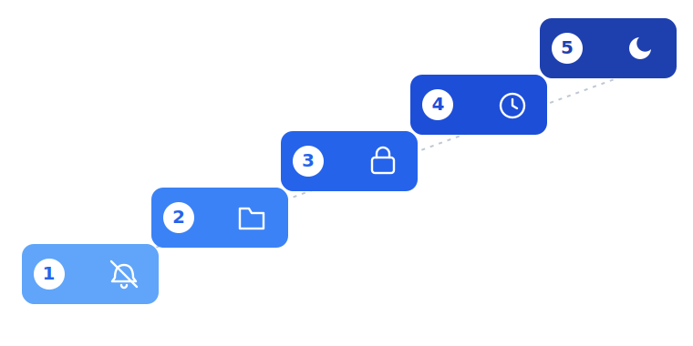

# Week 2. Building Barriers

There's a difference between "willpower" and "environment." Willpower 
is a limited, depletable resource — the more decisions you make in a 
day, the less willpower is left by evening. Environment works 
differently: remove the temptation from sight, or make it slightly 
less convenient, and you don't have to spend willpower at all — the 
choice simply doesn't come up as often.

This week is about restructuring your environment around the specific 
triggers you found last week.

## Step One: Get the App Off Your Home Screen

You don't have to delete the app entirely — for a lot of people that's 
too drastic and triggers a relapse. Start by removing the icon from 
your home screen and the bottom dock. Bury it in the farthest folder, 
somewhere on your third or fourth screen. Every extra action needed to 
reach the app lowers the odds of opening it automatically, without 
thinking.

## Step Two: Turn Off Autoplay and Notifications

Most short-video apps let you disable automatic advancement to the 
next clip and push notifications about new videos in settings. Do 
this. Autoplay is one of the main mechanisms that removes the natural 
stopping point — without it, you have to consciously swipe to the 
next one instead of just drifting along.

## Step Three: Use Built-in Screen Time Limits

Your phone has a built-in app time limit feature. Set a realistic 
limit — not "5 minutes a day" if you're currently at two hours, but 
something like "30% below your current average." A sudden drop to 
zero works worse than a gradual reduction — your brain has time to 
adapt.

## Step Four: Target Your Specific Triggers

Take the trigger list from last week and come up with a small 
obstacle for each one.

If the trigger is scrolling in bed before sleep, keep your phone 
charger away from the pillow — the other side of the room, or in a 
different room entirely.

If the trigger is boredom in line or on transit, try putting 
something else in your pocket ahead of time — something that requires 
attention, even a physical book or just deciding to think about 
something specific.

If the trigger is procrastination before a hard task, the issue isn't 
really the app — it's the task: try breaking it into a smaller piece, 
so the barrier to starting work is lower than the barrier to 
scrolling.

## The Exact Steps, by Phone

If you want the precise taps, here they are. Menu names drift a little
between phone models and OS versions, so read these as "look for
something like this," not exact coordinates. Each step up the ladder
puts a few more seconds between you and the feed.

**On iPhone (iOS)**

1. Notifications off: Settings → Notifications → the app → turn off
   Allow Notifications.
2. Off the home screen: press and hold the icon → Remove App → Remove
   from Home Screen. It stays installed in the App Library, just no
   longer one thumb-tap away.
3. Make getting in cost something: log out of your account, so opening
   it needs a password.
4. A daily limit: Settings → Screen Time → App Limits → add the app,
   and set a cap a little under your current average — not zero.
5. Out of the bedroom: turn on the Sleep focus and charge the phone in
   another room. A cheap alarm clock takes over the wake-up job.

**On Android**

1. Notifications off: Settings → Notifications → the app → turn them
   off. While you're in the app, turn off autoplay too.
2. Off the home screen: press and hold the icon → Remove — it stays in
   the app drawer, just off your main screen.
3. Make getting in cost something: log out, or use Digital Wellbeing's
   "Pause app" so relaunching takes a deliberate step.
4. A daily limit: Settings → Digital Wellbeing & parental controls →
   App timers → set a timer on the app.
5. Out of the bedroom: turn on Bedtime mode and charge the phone
   somewhere you can't reach from the bed.

None of these block you outright. They just slow you down enough that
the urge often passes before you're back in the feed.

## An Important Clarification

The goal this week isn't zero minutes on the app. The goal is making 
every time you open it a conscious decision, not a reflex. If you 
open the app but do it consciously, knowing why — that's already a 
big step forward compared to automatic scrolling.

By the end of the week you should notice noticeably fewer "accidental" 
opens and a bit more space where the feed used to be. That space 
matters — it shouldn't stay empty, which is what the next part is 
about.